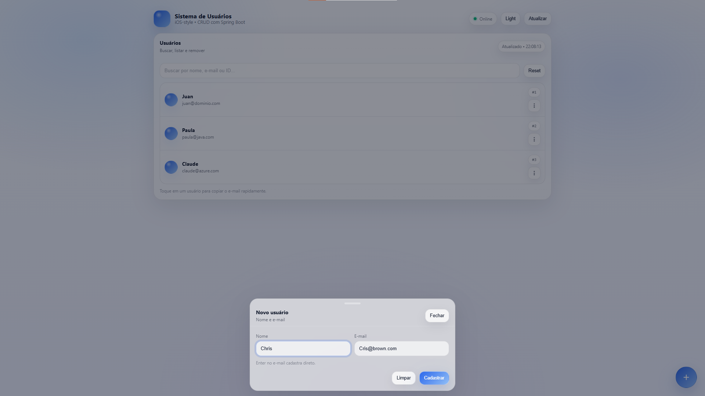

# Sistema de Usuários

  

Aplicação web simples para gerenciamento de usuários.

Projeto full stack desenvolvido com **Spring Boot (backend)** e **HTML, CSS e JavaScript puro (frontend)**, com interface inspirada no estilo iOS.

---

## 🚀 Funcionalidades

- ✅ Cadastrar usuário
- ✅ Listar usuários
- ✅ Buscar por nome, e-mail ou ID
- ✅ Remover usuário
- ✅ Interface responsiva
- ✅ Tema Light/Dark
- ✅ Status da API em tempo real

---

## 🛠️ Tecnologias utilizadas

### Backend
- Java 17+
- Spring Boot
- Maven

### Frontend
- HTML5
- CSS3 (Glassmorphism + iOS style)
- JavaScript (Fetch API)

---

## 📡 Endpoints da API

Base URL:

http://localhost:8080/api/usuarios

| Método | Rota | Descrição |
|--------|------|-----------|
| GET | /api/usuarios | Lista todos os usuários |
| POST | /api/usuarios | Cadastra um novo usuário |
| DELETE | /api/usuarios/{id} | Remove um usuário |

---

## ▶️ Como rodar o projeto

1️⃣ Clonar o repositório

git clone https://github.com/seu-usuario/sistema-usuarios.git

2️⃣ Entrar na pasta
cd sistema-usuarios

3️⃣ Rodar com Maven
mvn spring-boot:run

ou executar pela IDE (IntelliJ / VS Code).

A aplicação ficará disponível em:
http://localhost:8080

🎯 Objetivo do projeto

Esse projeto foi desenvolvido para praticar:

Estruturação de API REST

Organização em camadas (Controller, Service, Repository, Model)

Integração Frontend + Backend

Manipulação de requisições com Fetch API

Construção de interface moderna sem frameworks

📌 Observações

O projeto utiliza armazenamento em memória (Map / ConcurrentHashMap).
Os dados são reiniciados ao reiniciar a aplicação.

👨‍💻 Autor

Desenvolvido por Juan Delgado (Pcthelab)
